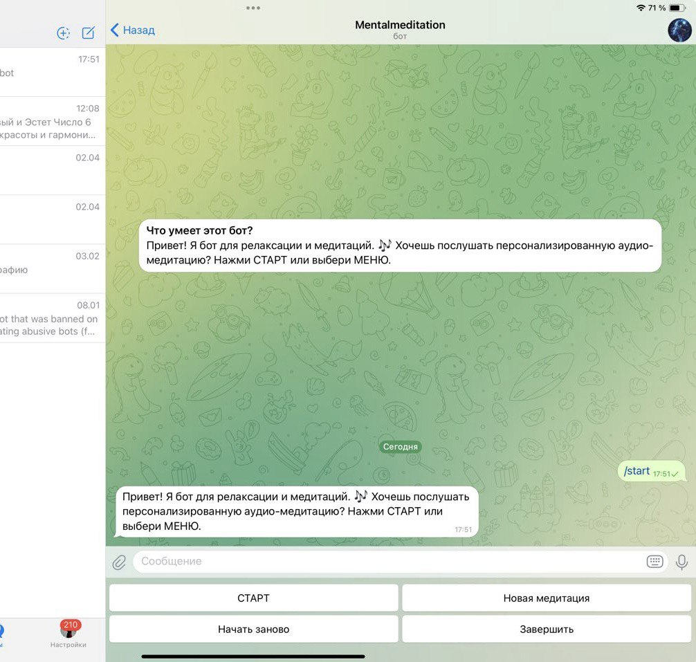
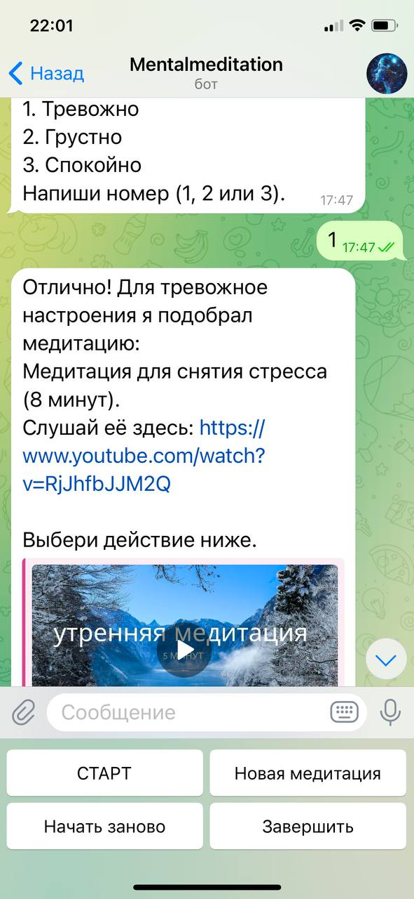

# Telegram Meditation Bot

Бот для релаксации и персонализированных медитаций. Помогает пользователям достигать состояния релаксации через аудио-медитации с YouTube, подобранные под их настроение (все медитации длиной 5-10 минут от toki well-being и Milky Vegan Yoga). Бот предлагает удобную клавиатуру с кнопками для навигации.

## Установка

1. Клонируйте репозиторий:git clone <ссылка_на_репозиторий> cd telegram-meditation-bot
2. Создайте виртуальное окружение и активируйте его:python -m venv .venv .venv\Scripts\activate # Для Windows
3. Установите зависимости: pip install -r requirements.txt
4. Создайте бота в Telegram через @BotFather и получите токен.
5. Создайте файл `.env` в корне проекта и укажите токен: TELEGRAM_BOT_TOKEN=ваш_токен
6. Запустите бота: python python_telegram-bot.py

## Использование

- При запуске бота нажмите "СТАРТ" (кнопка появляется автоматически).
- Выберите "Новая медитация", чтобы выбрать медитацию по настроению (1. Тревожно, 2. Грустно, 3. Спокойно).
- Получите ссылку на аудио-медитацию с YouTube.
- Используйте кнопки "Начать заново", "Новая медитация" или "Завершить" для навигации.
- Нажмите "МЕНЮ" для альтернативного выбора действий.

## Пример работы

### Начало работы (кнопка "СТАРТ")

### Работа на iPad

### Работа на iPhone
